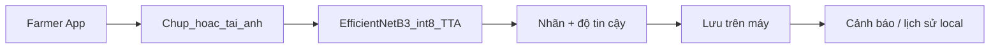

# RiceGuardian AI — App Di Động (Flutter)


> **Tài liệu nguồn sự thật** cho việc phát triển App di động RiceGuardian AI.  
> Trước khi xây dựng hoặc chỉnh sửa bất kỳ chức năng nào, **đọc file này đầu tiên**.

---

## Mục lục

1. [Tóm tắt dự án](#1-tóm-tắt-dự-án)
2. [Ngữ cảnh nghiệp vụ](#2-ngữ-cảnh-nghiệp-vụ)
3. [Tông màu thương hiệu](#3-tông-màu-thương-hiệu)
4. [Công nghệ & Kiến trúc](#4-công-nghệ--kiến-trúc)
5. [AI nhận diện bệnh hại (on-device)](#5-ai-nhận-diện-bệnh-hại-on-device)
6. [Nguyên tắc cảnh báo](#6-nguyên-tắc-cảnh-báo)
7. [Danh sách chức năng (F1–F11)](#7-danh-sách-chức-năng-f1f11)
8. [Chạy trên điện thoại thật](#8-chạy-trên-điện-thoại-thật)
9. [Nguyên tắc khi phát triển](#9-nguyên-tắc-khi-phát-triển)

---

## 1. Tóm tắt dự án

**RiceGuardian AI** là nền tảng AI dự báo sớm bệnh hại và quản lý canh tác lúa thông minh. App di động này dành riêng cho **Nông dân**, giúp:

- Xem dữ liệu ruộng của mình
- Chụp ảnh cây lúa để AI nhận diện bệnh **trực tiếp trên điện thoại**
- Xem cảnh báo bệnh hại
- Xem dữ liệu cảm biến IoT dạng đơn giản
- Ghi nhật ký canh tác

| Thuộc tính | Giá trị |
|---|---|
| **Vai trò người dùng** | Chỉ Nông dân |
| **Công cụ phát triển** | Android Studio |
| **Framework** | Flutter (native Android, không phải WebView/PWA) |
| **Mục tiêu chạy** | Điện thoại Android thật (real device) |
| **Package name** | `app_riceguardianai` |

---

## 2. Ngữ cảnh nghiệp vụ

### Vai trò & tài khoản
- App chỉ phục vụ **1 vai trò: Nông dân**.
- **UI-only (mặc định hiện tại):** demo login trên máy — `0901234567` / `Demo@123`. Không gọi farmer API trong monorepo (`ApiClient.isConfigured` = false).
- Số liệu hệ thống (KPI, diện tích, sensor, badge, % tin cậy trên list cảnh báo) hiển thị **`-`**. Giữ tên thửa / tiêu đề cảnh báo làm khung UI.

### Cấu hình API backend

Farmer API **không còn trong monorepo**. Launch: **RiceGuardian (offline)** trong `.vscode/launch.json`.

```bash
flutter run
```

Khi teammate backend deploy xong, có thể mở lại tích hợp remote riêng (ngoài phạm vi UI-only hiện tại).

### Mô hình dữ liệu liên quan
```
Thửa ruộng → Mùa vụ → Nhật ký canh tác → Cảnh báo bệnh hại
Thửa ruộng → Trạm IoT
```
- 1 thửa ruộng có thể liên kết **nhiều hộ nông dân**.
- Dữ liệu cảm biến là **time-series** — App chỉ hiển thị dạng đơn giản/tức thời, không cần biểu đồ phức tạp như Web.

### Nguồn dữ liệu đầu vào hệ thống
Ảnh nông dân chụp qua App là **1 trong 3 nguồn dữ liệu chính** (cùng với cảm biến IoT và ảnh UAV). Kết quả nhận diện có thể sinh ra cảnh báo cần kỹ thuật viên nông nghiệp xác nhận.

---

## 3. Tông màu thương hiệu

Mọi màn hình Flutter phải tuân theo bảng màu sau (không tự ý đổi trừ khi được yêu cầu):

| Tên | Hex | Flutter `Color` | Dùng cho |
|---|---|---|---|
| **Primary** (xanh lúa) | `#2E7D32` | `Color(0xFF2E7D32)` | AppBar, nút chính, điểm nhấn |
| **Secondary** (vàng lúa) | `#F9A825` | `Color(0xFFF9A825)` | Cảnh báo nhẹ, badge, accent |
| **Danger** (đỏ) | `#C62828` | `Color(0xFFC62828)` | Cảnh báo nghiêm trọng, lỗi |

> Gợi ý: định nghĩa tập trung tại `lib/config/app_theme.dart` hoặc `lib/config/app_colors.dart`.

---

## 4. Công nghệ & Kiến trúc

### Stack cố định

| Thành phần | Công nghệ | Vị trí |
|---|---|---|
| **App di động** | Flutter (offline-first) | `app/lib/` |
| **Lưu trữ trên máy** | SharedPreferences + file ảnh | `lib/services/local_store.dart` |
| **Đăng nhập** | Flask JWT + Supabase Auth (offline demo nếu thiếu `API_BASE_URL`) | `lib/services/auth_service.dart`, `lib/services/api_client.dart` |
| **AI nhận diện** | On-device TFLite (EfficientNetB3 int8, pipeline v3 trial) | `lib/services/ai_service.dart` |

> API nông dân / staff: repo backend riêng. Monorepo app = **UI-only** (demo login + số liệu hệ thống = `-`). `packages/rg_core` chỉ phục vụ `site/backend`.

### Nguyên tắc Offline-first

App **hoạt động không cần mạng** cho dữ liệu nghiệp vụ trên máy:
- Đăng nhập local (demo: `0901234567` / `Demo@123`)
- Ruộng, ảnh, cảnh báo, nhật ký, cài đặt lưu trên điện thoại
- Không cần Render / Flask / cùng WiFi với máy tính
- Cài APK trên điện thoại bất kỳ, mạng bất kỳ đều dùng được

### Cấu hình

Không còn `API_BASE_URL`. Launch config: **RiceGuardian (offline)** trong `.vscode/launch.json`.

### Tối ưu hiệu năng

**Flutter:**
- `ListView.builder` cho mọi danh sách dài
- Ảnh lịch sử dùng `Image.file` (đường dẫn local)
- Hạn chế rebuild: `const` constructor, Provider/Selector

---

## 5. AI nhận diện bệnh hại (on-device)

### Model nguồn

Thư mục: [`rice_pipeline_v3_mobile_trial/`](rice_pipeline_v3_mobile_trial/) (bản train gốc; app dùng bản copy trong `assets/models/`)

| File | Mô tả |
|---|---|
| `rice_leaf_cls_int8.tflite` | EfficientNetB3 classifier, **int8**, input `300×300` (~12 MB) |
| `rice_det_yolov8s_float32.tflite` | YOLOv8s detector (từ `session_b_checkpoint/yolo_best.pt`), **float32**, input `[1,640,640,3]` 0..1 letterbox, output `[1,13,8400]` (~45 MB) |
| `class_indices.json` | Tên lớp → chỉ số output (8 lớp) |
| `pipeline_config.json` | `img_size`, `reject_threshold`, `temperature`, `tta_views`, `release_channel`; khối `detector` (`conf_thresh`, `nms_iou`, `crop_padding`, `class_names`) và `region_rules` |
| `training_report.json` | Báo cáo train (chỉ tham khảo, không bundle vào app) |

Đổi model: chép file vào `assets/models/` rồi build lại — `ai_service.dart` đọc cấu hình từ `pipeline_config.json`, không hard-code. Thiếu khối `detector` (hoặc nạp detector lỗi) → app chạy classifier toàn ảnh, không có box.

Kiểm tra detector TFLite so với `.pt`: `py app/scripts/parity_yolo_tflite.py <ảnh...>` (cần `ultralytics`, `ai-edge-litert`). Lần chạy 07/10 trên 7 ảnh: 7/7 khớp (cùng số box, IoU ≥ 0.9, conf lệch ≤ 0.05). Chưa có số đo mAP của bản TFLite (`map50_tflite: null`); mAP50 của `.pt` theo report là 0.838.

### Trạng thái: **trial**

`release_channel = trial`, `gate_passed = false` (mục tiêu acc 0.85). Theo `training_report.json`: TFLite test acc ~0.77, macro F1 (Keras, TTA) ~0.81; recall **Đốm nâu** thấp (~0.51, hay nhầm sang Đốm nâu hẹp). Màn kết quả hiển thị chú thích "mô hình thử nghiệm" khi `release_channel = trial`.

### Runtime trên app (2 giai đoạn: classifier toàn ảnh + detector khoanh vùng)

Inference trong [`lib/services/ai_service.dart`](lib/services/ai_service.dart); tiền xử lý và luật hiển thị trong [`lib/services/classifier_preprocess.dart`](lib/services/classifier_preprocess.dart) (`buildDiseaseView`); detector trong [`lib/services/yolo_tflite_helper.dart`](lib/services/yolo_tflite_helper.dart).

1. **Classifier toàn ảnh**: RGB, resize kéo giãn `300×300`, pixel **0..255**; TTA `orig` / `hflip` / `vflip` → trung bình; int8 lượng tử theo `scale` / `zero_point`; softmax (`temperature`).
2. **Detector**: letterbox 640 (pad 114), parse `[1,13,8400]`, `conf_thresh` 0.15, NMS `nms_iou` 0.7, tối đa 3 box. Nhãn lớp detector **chỉ tham khảo** (`labels_informational_only`) — detector chỉ dùng để lấy vị trí.
3. **Crop**: mỗi box nới `crop_padding` 25%, chạy classifier (không TTA). Box **hợp lệ** khi crop ra một bệnh (khác Khỏe mạnh) với xác suất ≥ 0.45.
4. **Kết luận** (`buildDiseaseView`):
   - **Có bệnh**: toàn ảnh ra bệnh ≥ 0.45, hoặc có box hợp lệ ≥ 0.5 (`second_disease_min_conf`). Bệnh chính lấy từ toàn ảnh (`primary_from: full_image_classifier`); nếu toàn ảnh không ra bệnh thì lấy box mạnh nhất.
   - **Khỏe mạnh**: toàn ảnh ra Khỏe mạnh ≥ 0.45 và không có box hợp lệ ≥ 0.5. Không vẽ box, không hiện thanh bệnh.
   - **Chưa rõ**: các trường hợp còn lại.
   - **Bệnh phụ** (tối đa 1): chỉ khi có box hợp lệ ≥ 0.5 mang bệnh khác bệnh chính. Box của bệnh thứ 3 trở đi không vẽ.
5. **% khả năng mắc bệnh** (không phải diện tích vết bệnh):
   - `q` = xác suất toàn ảnh sau khi bỏ Khỏe mạnh và chuẩn hoá trong nhóm bệnh; `c` = tương tự trên crop (lấy cao nhất); điểm `s = max(q, c)`.
   - 1 bệnh → hiện `s`. 2 bệnh → chia tỉ lệ `s_chính / (s_chính + s_phụ)`, tổng 100%.
   - `confidence` lưu khi bấm "Lưu trên máy" là đúng % đang hiển thị của bệnh chính.
   - Chuẩn hoá là quy ước hiển thị, không làm mô hình chính xác hơn.

Màn kết quả: box bệnh chính màu `danger`, bệnh phụ màu `secondary`; card "Khả năng mắc bệnh" chỉ hiện khi có bệnh. Không có kết quả giả/mock: thiếu model → báo "Chưa có mô hình nhận diện trên máy."; lỗi → trạng thái lỗi.

Giới hạn đã biết: detector có thể khoanh nhầm trên ảnh không phải lá lúa (đã thấy với chữ / logo trên ảnh chụp màn hình) — bước lọc bằng crop giảm nhưng không loại hết; detector chạy cả với ảnh khỏe nên thời gian xử lý tăng, cần đo trên máy thật.

Model cũ (YOLO `rice_disease.tflite` + DenseNet `rice_classifier.tflite`, ~168 MB) đã gỡ khỏi `assets/`. Script `scripts/export_rice_leaf_tflite.py` / `export_rice_classifier_tflite.py` thuộc pipeline cũ.

### 8 lớp model (`class_indices.json` → nhãn hiển thị, `lib/data/disease_code_map.dart`)

| # | Lớp model | Nhãn app |
|---|---|---|
| 0 | Bacterial Leaf Blight | Bạc lá |
| 1 | Brown Spot | Đốm nâu |
| 2 | Healthy Rice Leaf | Khỏe mạnh |
| 3 | Leaf Blast | Đạo ôn lá |
| 4 | Leaf scald | Cháy lá |
| 5 | Narrow Brown Leaf Spot | Đốm nâu hẹp |
| 6 | Rice Hispa | Hispa |
| 7 | Sheath Blight | Khô vằn (chưa có hướng dẫn trong catalog) |

### Luồng nghiệp vụ (F4)



1. Nông dân chụp ảnh cây lúa **hoặc tải ảnh từ thư viện** (màn hình camera)
2. App chạy **inference cục bộ** (classify + TTA) → trả nhãn bệnh + độ tin cậy, hoặc "không chắc chắn"
3. Hiển thị kết quả ngay trên điện thoại
4. Nông dân chọn **Lưu trên máy** → ảnh + metadata lưu vào bộ nhớ máy; bệnh ≠ khỏe mạnh tạo cảnh báo local
5. Không upload server / không cần mạng

---

## 6. Nguyên tắc cảnh báo

Phân biệt rõ **2 loại** khi hiển thị trên App:

| Loại | Nguồn | Mô tả hiển thị |
|---|---|---|
| **Cảnh báo nguy cơ** | Dự báo từ môi trường bất thường (IoT, AI forecast) | "Nguy cơ cao — độ ẩm vượt ngưỡng" |
| **Kết quả nhận diện bệnh** | Ảnh chụp + AI on-device (đã có biểu hiện) | "Phát hiện: Đạo ôn lá — 87% tin cậy" |

Không trộn lẫn 2 loại trong cùng 1 UI element.

---

## 7. Danh sách chức năng (F1–F11)

| ID | Chức năng | Cấp độ UX | Mô tả ngắn |
|---|---|---|---|
| **F1** | Đăng nhập | Dedicated screen | SĐT + mật khẩu local → Dashboard |
| **F2** | Dashboard tổng quan | Chỉ xem | Số thửa, cảnh báo mới nhất, lối tắt chụp ảnh |
| **F3** | Danh sách & bản đồ ruộng | Chỉ xem | Thửa ruộng seed/local + vị trí trên bản đồ |
| **F4** | Chụp ảnh & nhận diện bệnh | Dedicated screen | Camera hoặc tải ảnh thư viện → AI on-device → lưu trên máy |
| **F5** | Lịch sử ảnh & kết quả | Chỉ xem | Danh sách local, `ListView.builder` |
| **F6** | Xem cảnh báo | Chỉ xem | Cảnh báo tạo từ ảnh lưu local |
| **F7** | Dữ liệu cảm biến IoT | Chỉ xem | Offline: thông báo không khả dụng |
| **F8** | Ghi nhật ký canh tác | Modal | Form ngắn, lưu trên máy |
| **F9** | Trung tâm thông báo | Chỉ xem + Inline | Thông báo local / remote; `article_reply` mở thread hỏi–đáp |
| **F10** | Hồ sơ cá nhân | Inline + Modal | Sửa thông tin, đổi mật khẩu local |
| **F11** | Cài đặt App | Inline | Ngôn ngữ, bật/tắt thông báo |
| **F12** | Bản tin nông dân | Dedicated + list | Gộp bài published qua Flask (khi có `API_BASE_URL`) với tin thị trường đóng gói từ site (đọc được offline), sắp theo ngày mới nhất |
| **F13** | Hỏi đáp bản tin | Modal + dedicated | Gửi thắc mắc theo bài; xem trả lời; FAQ công khai dưới bài (chỉ bài từ API, không áp dụng tin từ site) |

### Bản tin từ site

Tin thị trường lúa gạo của website giới thiệu được đóng gói tĩnh vào App:

- Dữ liệu: `assets/news/site_news.json` (xuất từ `site/src/data/news.js`, giữ nguyên cấu trúc; `cover.src` / `figure.src` là tên file ảnh trong `assets/news/`).
- Ảnh: copy từ `site/src/assets/news/` vào `assets/news/`.
- Id trong App: `site-<slug>` (route `/news/site-<slug>`), danh mục "Thị trường" (`thi_truong`), lọc cục bộ, không gửi lên API.
- Load bằng `lib/services/site_news_service.dart`; chi tiết render bởi `lib/screens/news/site_news_body.dart`.

**Đồng bộ thủ công:** mỗi khi sửa `site/src/data/news.js` hoặc thêm ảnh tin, cập nhật lại `site_news.json` và ảnh trong `app/assets/news/` rồi chạy `flutter test test/site_news_service_test.dart` (kiểm tra JSON hợp lệ và đủ file ảnh).

### Quy chuẩn UX cho thao tác chỉnh sửa

| Cấp độ | Hình thức | Khi nào dùng |
|---|---|---|
| **Nhỏ (Inline)** | Sửa trực tiếp tại chỗ | 1 giá trị đơn lẻ (bật/tắt, đánh dấu đã đọc) |
| **Trung bình (Modal)** | Bottom sheet / dialog | Nhiều trường nhưng ngữ cảnh gần (đổi MK, ghi nhật ký) |
| **Lớn (Dedicated screen)** | Màn hình riêng, route riêng | Luồng độc lập, nhiều bước (camera, xem trước ảnh) |

---

## 8. Chạy trên điện thoại thật

App là **native Android thật** (Flutter compile ra `.apk`/`.aab`), không phải WebView bọc website.

### Cách 1: Debug qua Android Studio (khi đang code)

```bash
# Bật Chế độ nhà phát triển + USB Debugging trên điện thoại
flutter devices
flutter run
# Không cần API / dart-define — app offline
```

### Cách 2: Build file cài đặt thật (phát hành / cài độc lập)

```bash
flutter build apk --release
# Output: build/app/outputs/flutter-apk/app-release.apk

flutter build appbundle --release
# Output: build/app/outputs/bundle/release/app-release.aab (cho Google Play)
```

Copy `.apk` sang điện thoại bất kỳ (mạng bất kỳ) và cài trực tiếp. Đăng nhập demo: `0901234567` / `Demo@123`.

### Lưu ý quan trọng

- Điện thoại là thiết bị mạng **riêng biệt** — `localhost` trên điện thoại trỏ vào chính nó, **không** trỏ được backend trên máy tính.
- Bản `.apk` release **bắt buộc** dùng API base URL public (backend đã deploy trên Render), không phụ thuộc cùng mạng LAN.
- HTTP LAN (`http://192.168.x.x`) chỉ được phép ở bản **debug/profile** (`usesCleartextTraffic` trong `android/app/src/debug` và `profile`).
- Bản phát hành chính thức phải dùng **HTTPS**.

---

## 9. Nguyên tắc khi phát triển

1. **Đọc README này trước** khi code bất kỳ chức năng mới nào.
2. Nếu chưa rõ → **hỏi lại**, không tự giả định.
3. Code đúng cấu trúc thư mục đã scaffold (`lib/`), không tạo cấu trúc mới trừ khi cần thiết và giải thích lý do.
4. Không tự ý đổi stack, kiến trúc, hoặc schema database.
5. Nếu chức năng động chạm mô hình dữ liệu, nêu rõ thay đổi schema **trước khi code**.
6. Giao diện tuân theo [tông màu thương hiệu](#3-tông-màu-thương-hiệu).
7. Mọi chức năng gọi API mới: xác nhận API base URL đang trỏ đúng backend trước khi test trên điện thoại.
8. Mọi màn hình là **widget Flutter thật** — không đề xuất WebView bọc website.
9. Hướng tới build `.apk`/`.aab` cài đặt thật, không chỉ chạy debug.

---

*RiceGuardian AI — Bảo vệ mùa màng bằng trí tuệ nhân tạo.*
